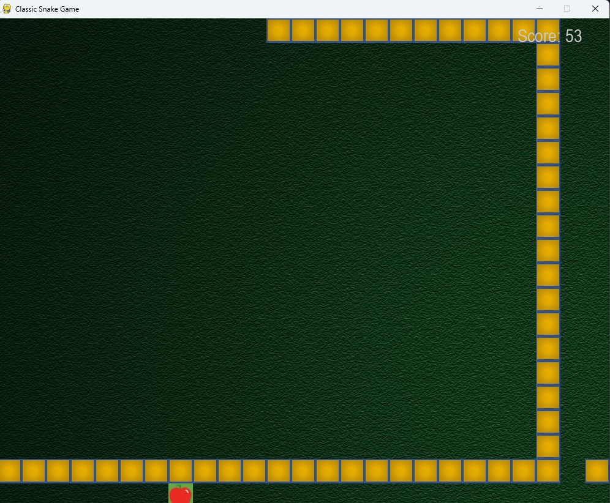
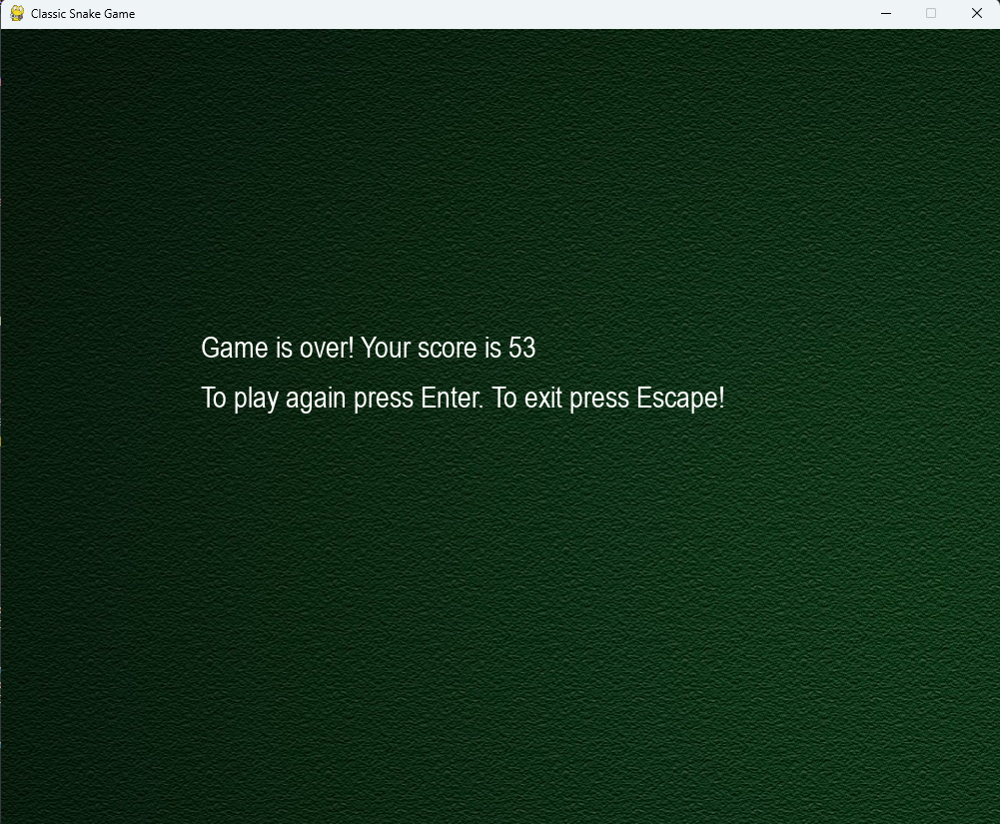

# 🐍 Classic Snake Game (Pygame)

## 📚 Description

This is a not so modern (lol) version of the classic Snake Game built with **Python** and **Pygame**, using an object-oriented approach. The player controls a snake that grows in length each time it eats an apple. The game includes collision detection, background music, sound effects, and score tracking.

---

## 🛠️ Technologies Used

- Python
- Pygame  
- OOP (Object-Oriented Programming)  
- Game loop logic  
- Basic image and sound handling

---

## 🚀 How to Run

```bash
# Clone the repository
git clone https://github.com/andre-maccarini/classic-snake-game-python.git

# Navigate to the project folder
cd classic-snake-game-python

# Install dependencies
pip install pygame

# Run the game
python snake.py
```

⚠️ Make sure the resources/ folder is in the same directory, and includes:

block.jpg (snake block)

apple.jpg (apple)

background.jpg

bg_music_1.mp3 (background music)

1_snake_game_resources_crash.mp3

1_snake_game_resources_ding.mp3

🎮 Preview




## 📊 Features
✅ Arrow key controls (↑ ↓ ← →)

✅ Apples appear randomly; eating them increases score and snake length

✅ Collision detection with self

✅ Real-time score display

✅ Background music and sound effects

✅ Game over screen with restart prompt

✅ Snake wraps around the screen (borderless gameplay)

## 🧠 What I Learned
Managing game state and collisions using OOP

Drawing and updating sprites in real time

Playing sounds and music with Pygame

Handling keyboard events and delays using time.sleep()

Dynamically scaling game speed as snake grows

## 📈 Possible Improvements
 Add difficulty levels or speed modes

 Add a high score tracker or leaderboard

 Make game mobile-friendly using Pygame GUI

 Improve art assets and animations

## ✍️ Author
André Maccarini